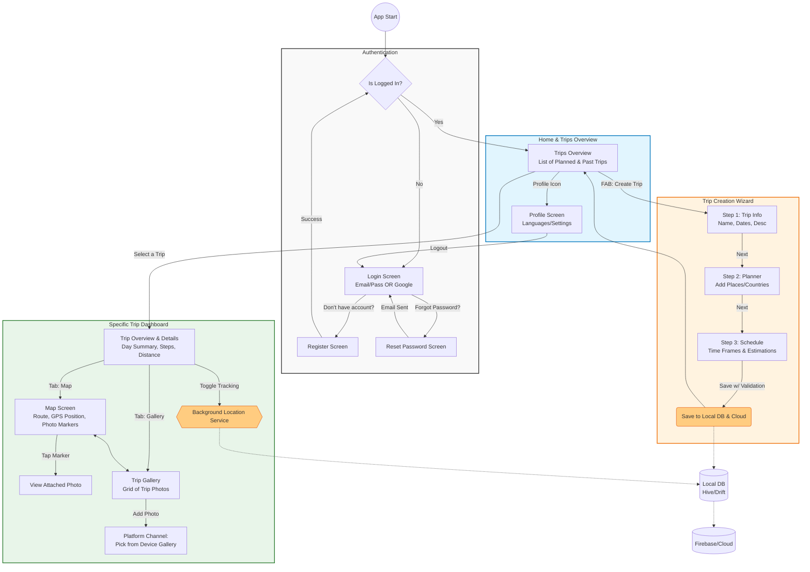

# INITIAL DOCUMENTATION

# SCREENS

## Account Creation & Login

### Login

### Register

## Current Trip

### Navigation

### Trip Details

## Trips

### My trips

### Trip Creation

#### Where and when screen

- Where to where
- When to when

#### Add places screen

- add places

#### Schedule

- edit schedule

#### Configuration

- set pace
- view places
- view schedule

# OPTIONAL REQUIREMENTS

## First

- 5p. Firebase Auth Sign-in
- 10p. Multi-Step form with validation (Trip Creation & Planner)

## Second

- 15p. Local Data Persistence (Saved offline data)
- 5p/15p. Platform Channels (Photos, Maps, Localization)

## Last

- 5p. Animations
- 10p. Internationalization (Multiple Languages)

